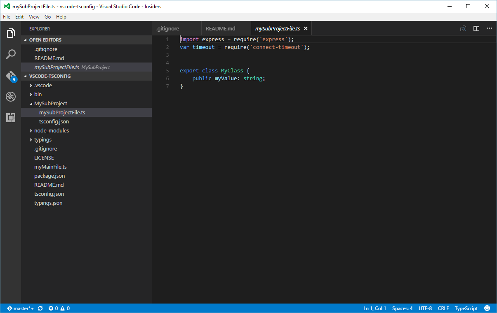
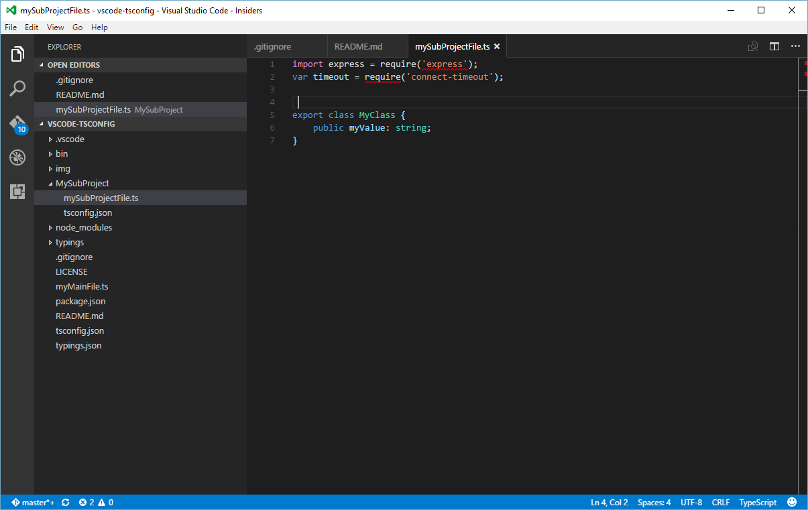

# vscode-tsconfig

The demonstration project that shows possible problem with multiple 
`tsconfig.json` files in subdirectories.

# Setup 
Tested with the following versions:
- nodejs 6.2.0
- typescript 1.8.9
- typings 1.3.2

Steps to reproduce the problem:
1. Clone the project
2. In project directory execute commands:
    - `npm install` - to download  dependencies
    - `typings install` - to download required typings files

## TypeScript
In working directory run the command: `tsc -p .`

Should compile correctly.

## vscode

Select the right file in a editor window and compile the project:
1. Select the the file: `./MySubProject/mySubProjectFile.ts` 
2. Compile the project: `Ctrl-Shift-B`

The project should be compiled without errors. You should get something like on the screen below:

 

Now press space in any *syntactically correct* place. You get compilation errors like on screen below:

 

The errors are:
- `[ts] Cannot find module 'express'.`
- `[ts] Cannot find name 'require'.`

